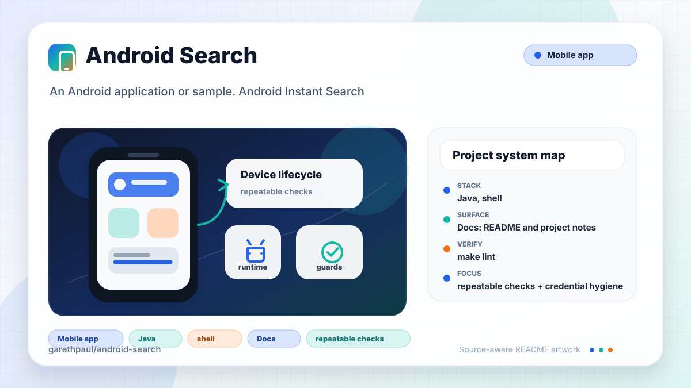

# android-search

<!-- README-OVERVIEW-IMAGE -->


## Overview

`garethpaul/android-search` is an Android application or sample. Android Instant Search

This legacy Android search sample sends the user's query to the
`garethpaul-app.appspot.com` backend and displays returned text and image data.

This README is based on the checked-in source, manifests, scripts, and repository metadata on the `master` branch. The project language mix found during review was: Java (3), shell (1).

## Repository Contents

- `README.md` - project overview and local usage notes
- `build.gradle` - Android or Gradle build configuration
- `app` - source or example code
- `docs` - source or example code
- `gradle` - source or example code
- `gradlew` - Android or Gradle build configuration
- `scripts` - source or example code
- `SECURITY.md` - security reporting and disclosure guidance
- `VISION.md` - project direction and maintenance guardrails

Additional scan context:

- Source directories: app, docs, gradle, scripts
- Dependency and build manifests: build.gradle, gradlew
- Entry points or build surfaces: Gradle build files
- Test-looking files: app/src/androidTest/java/gpj/androidsearch/ApplicationTest.java

## Getting Started

### Prerequisites

- Git
- Android Studio or a compatible Android SDK
- Gradle or the checked-in Gradle wrapper when present

### Setup

```bash
git clone https://github.com/garethpaul/android-search.git
cd android-search
make check
scripts/check-baseline.sh
./gradlew lint --no-daemon
./gradlew test --no-daemon
./gradlew assembleDebug --no-daemon
```

The setup commands above are derived from repository files. Legacy mobile, Python, or JavaScript samples may require older SDKs or package versions than a modern workstation uses by default.

## Running or Using the Project

- Use Android Studio to open the project or run `./gradlew assembleDebug` when the Android SDK is configured.

## Testing and Verification

- `make lint` - runs the SDK-free baseline and Gradle lint when the Android SDK is configured.
- `make test` - runs Gradle tests when the Android SDK is configured.
- `make build` - runs debug assembly when the Android SDK is configured.
- `make check` - runs the aggregate lint, test, and build gates.
- `scripts/check-baseline.sh` - runs SDK-free source baseline checks.
- The SDK-free baseline protects URL encoding, response fallbacks, timeout
  wiring, optional image handling, search intent/result view null-safety, and
  sensitive search log suppression.
- `./gradlew lint --no-daemon`, `./gradlew test --no-daemon`, and `./gradlew assembleDebug --no-daemon` when the Android SDK is configured.

When the required SDK or runtime is unavailable, use static checks and source review first, then verify on a machine that has the matching platform toolchain.

## Configuration and Secrets

- Detected references to Twitter. Keep API keys, OAuth credentials, tokens, and account-specific values in local configuration only.
- This legacy Android baseline pins Android build-tools 24.0.3 and Android Gradle Plugin 1.2.3.
- Search result image downloads require HTTPS and bounded connection/read
  timeouts before decoding the bitmap.
- The search activity guards nullable ActionBar setup before applying icon and
  home presentation.
- Search menu setup guards missing framework search UI pieces before wiring the
  searchable configuration or replacing the search icon.
- Search intent handling guards null intents and missing result views before
  reading query extras or rendering returned data.

## Security and Privacy Notes

- Review changes touching external API calls or credential-adjacent configuration; examples from the scan include proguard-com.twitter.sdk.android.twitter.txt.
- Review changes touching network requests, sockets, or service endpoints; examples from the scan include app/src/androidTest/java/gpj/androidsearch/ApplicationTest.java, app/src/main/AndroidManifest.xml, app/src/main/java/gpj/androidsearch/NetworkRequest.java, app/src/main/res/layout/activity_main.xml, and 6 more.
- Review changes touching mobile permissions or privacy-sensitive device data; examples from the scan include app/src/main/AndroidManifest.xml, gradlew.
- Review changes touching file, media, JSON, XML, CSV, OCR, or data parsing; examples from the scan include app/lint.xml, app/src/main/AndroidManifest.xml, app/src/main/java/gpj/androidsearch/MainActivity.java, app/src/main/java/gpj/androidsearch/NetworkRequest.java, and 6 more.

## Maintenance Notes

- This looks like a legacy Android project or sample. Expect Android SDK, Gradle, and support-library versions to matter.
- The current baseline URL-encodes search queries before calling the backend,
  normalizes missing query parameters, returns explicit JSON errors for failed
  requests, uses configured 1-second connection and socket timeouts, uses HTTPS
  Maven Central for dependency resolution, and pins build-tools to a
  host-compatible version.
- Search request success paths avoid logging full query URLs or raw response
  bodies.
- Search intent handling guards null intents and missing result views while
  preserving the existing search action flow.
- `app/lint.xml` suppresses only the obsolete lint API database error from this
  old toolchain and the missing-density-folder warning for bitmap assets
  intentionally kept in `drawable-nodpi`.
- Future work should replace the deprecated Apache HTTP client and AsyncTask
  flow, add testable request/response parsing, modernize SDK levels, and add
  emulator or device coverage.
- See `docs/plans/2026-06-08-search-response-guard-baseline.md` for the
  response handling and SDK-free wrapper baseline.
- See `docs/plans/2026-06-09-search-query-logging-privacy.md` for the search
  query logging privacy contract.
- See `docs/plans/2026-06-09-search-image-download-guard.md` for the HTTPS
  image download guard.
- See `docs/plans/2026-06-09-search-actionbar-guard.md` for the nullable
  ActionBar startup guard.
- See `docs/plans/2026-06-09-search-make-gate-targets.md` for the root
  lint, test, and build gate contract.
- See `docs/plans/2026-06-09-search-menu-null-safety.md` for the search menu
  setup null-safety contract.
- See `docs/plans/2026-06-09-search-intent-ui-guard.md` for the search
  intent and result view null-safety contract.
- See `SECURITY.md` for vulnerability reporting and safe research guidance.
- See `VISION.md` for project direction and contribution guardrails.

## Contributing

Keep changes small and tied to the project that is already present in this repository. For code changes, document the toolchain used, avoid committing generated dependency directories or local configuration, and update this README when setup or verification steps change.
